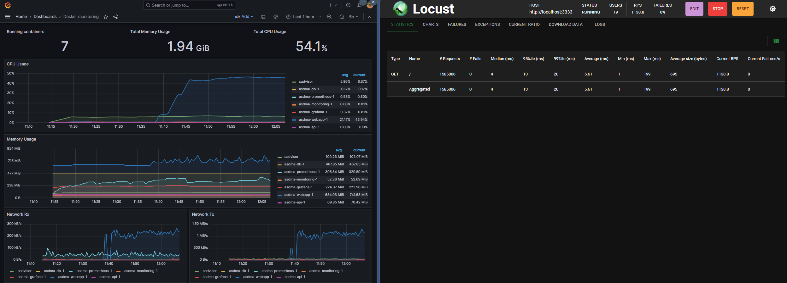

# 
# ADSMA - EPSI ASRBD Project
### Developped by Romain.T, Dominique.G, Samuel.M
## Project Files :
- deploy-ansible.yml
- docker-compose.yml
- inventory.ini
- requirements.txt
- basic-setup.sh
- supervision.py
- locustfile.py

## Installation :
```
git clone https://github.com/W4RSH3LL/ASDMA.git
cd ADSMA/
pip install -r requirements.txt
ansible-playbook deploy-ansible.yml -i inventory.ini
```
## Run a load test against the infrastructure
```
pwd
# C:\Users\user\ASDMA
pip install -r requirements.txt
locust 
# Go to http://localhost:8089/ to run load tests
```


## All available services address
| Service  | Address          |
| :--------------- |:---------------|
| Graphana    |http://localhost:3000/|
| Locust    |http://localhost:8089/|
| Papeterie   |http://localhost:3333/|
|Portainer   |https://localhost:9443/|
| Prometheus  |http://localhost:9090/|

## Functionnalities :
### deploy-ansible.yml
- [.1] Installs the necessary dependencies for Docker
- [.2] Add Docker GPG apt Key
- [.3] Add Docker Repository
- [.4] Update apt and install docker-ce
- [.5] Install Docker Module for Python
- [.6] Clone Docker Compose configuration from GitHub (specific branch)
- [.7] Install docker-compose
- [.8] Install Docker SDK for Python
- [.9] Update Docker
- [.10] Launch Docker Compose
------------------------------------------------
### docker-compose.yml
- db: image: mysql:8.3
- webapp: build: ./WebApp_Papeterie
- api: build: ./API
- monitoring: portainer/portainer-ce:latest
- prometheus : prom/prometheus
- graphana : grafana/grafana
- cadvisor: gcr.io/cadvisor/cadvisor:latest
------------------------------------------------
### inventory.ini
- Contains inventory of hosts that Ansible will manage.
------------------------------------------------
### prometheus/prometheus.yml 
- Defined sensor prometheus as to query (cadvisor for docker, and him self)
------------------------------------------------
### portainer (folder)
- Contains all portainer configurations files
------------------------------------------------
### grapfana (folder)
- Contains all grafana configurations files and dashboard
------------------------------------------------
### nginxed (folder)
- Contain the docker file for deploy an Nginx instance with SSH (PermitRoot yes) activated. 
